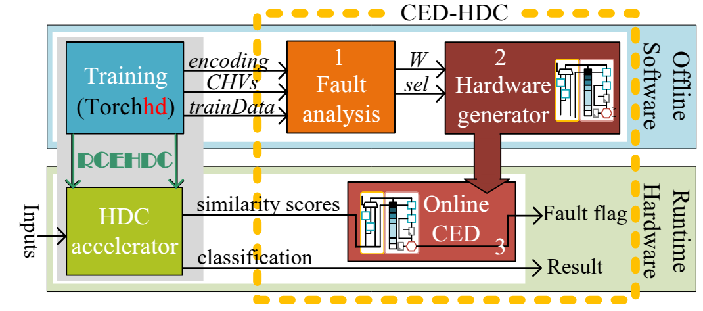
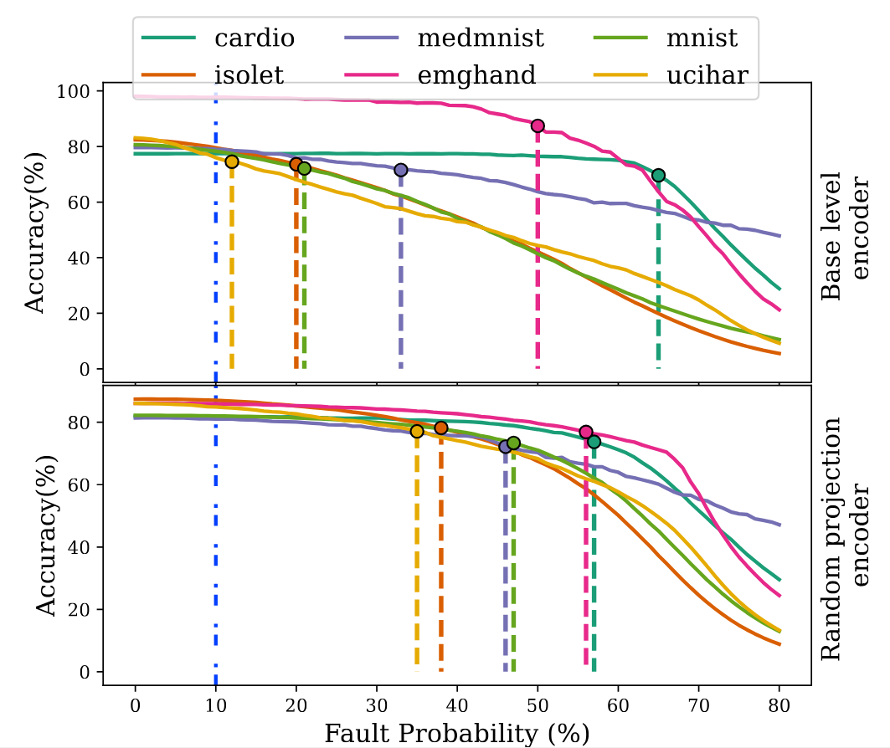
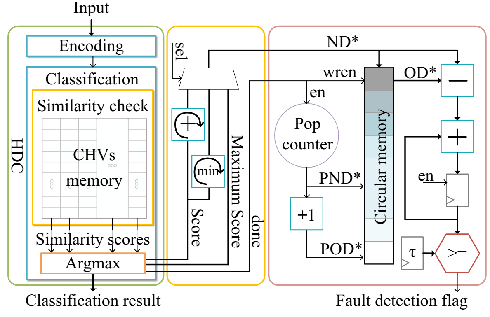

# CED-HDC
Lightweight Concurrent Error Detection for Reliable Hyperdimensional Computing (HDC)

## About CED-HDC

HyperDimensional Computing (HDC) is a machine learning paradigm that is well suited for edge devices due to its low-overhead inference hardware and inherent robustness to bit-flips and noise.
For safety-critical applications, reliability is paramount, with runtime failures posing a serious threat to HDC accelerators.
While HDC is robust to several bit flops in memory without significant loss of accuracy, its performance degrades rapidly once a critical threshold is exceeded where hardware faults exceed the tolerance capacity of the algorithm.
Ensuring reliable operation over the lifetime of the system remains a challenge, particularly with runtime hardware failures.
Conventional concurrent error detection (CED) methods often only address a limited number of faults or incur significant hardware overhead, which either fall under the algorithmic robustness of HDC or contradict the lightweight nature of HDC implementations.
In this work, we propose a lightweight CED method that is tailored to HDC systems.
Our method can dynamically detect faults before they cause noticeable accuracy degradation.
It introduces negligible hardware overhead ($<0.1\%$), no additional latency, and ensures 100\% coverage of critical errors.


## **System Overview**  

The diagram below illustrates our proposed **CED-HDC mechanism** for HDC accelerators. This framework:  
Detection mechanism flow: 1. Fault analysis, 2. Generate CED hardware based on configuration, 3. Employ CED hardware in HDC accelerator. $W$ denotes the monitoring window size for keeping track of the output scores, and $sel$ selects the optimal fault detection method. Model training is performed using [Torchhd](https://github.com/hyperdimensional-computing/torchhd), while the HDC-to-FPGA mapping is handled by [RCEHDC](git@github.com:m-spr/NUECC-HDC.git).  

   

Degradation of accuracy with different data sets and different error probabilities. Vertical lines mark error probabilities that cause a drop in accuracy of 10\%. While practical ECC implementations fail to detect beyond 10\% (vertical dashed blue line), the HDC models are robust and remain stable at  those fault probabilities. Configuration: $D$=10000, and $Q$=1.



## **Hardware Overview**  

The following figure presents the **CED-HDC architecture** along with the HDC accelerator.  
Fault detection module. PND*: Pointer to the Newest Data (writing address), POD*: Pointer to the Oldest Data (reading address). To simplify the architecture, the average score of the window is calculated before storing the new data in memory. The maximum score is obtained using Arg max, while the minimum and sum of scores are calculated sequentially.

  

---

## **Getting Started**  

To set up the framework, follow these steps:  

- Clone this repository  
- Make a new project based on [RCEHDC](git@github.com:m-spr/NUECC-HDC.git) 
- Modify the IP by replacing the modules in the hardware folder as required.


Citation
------------
If you find this work useful, please cite the following paper:
(Currently accepted and waiting for publication)
```
@inproceedings{roodsari20243,
  title={CED-HDC: Lightweight Concurrent Error Detection for Reliable Hyperdimensional Computing},
  author={Roodsari, Mahboobe Sadeghipour and Meyers, Vincent and Tahoori, Mehdi},
  booktitle={2025 43th IEEE VLSI Test Symposium (VTS)},
  year={2025},
  organization={IEEE}
}
```
Task List
------------
- [ ] add instructions to run the ECC python and memory generator codes
- [ ] add ECC memory to main project tcl
- [ ] add ECC module generator to the project

